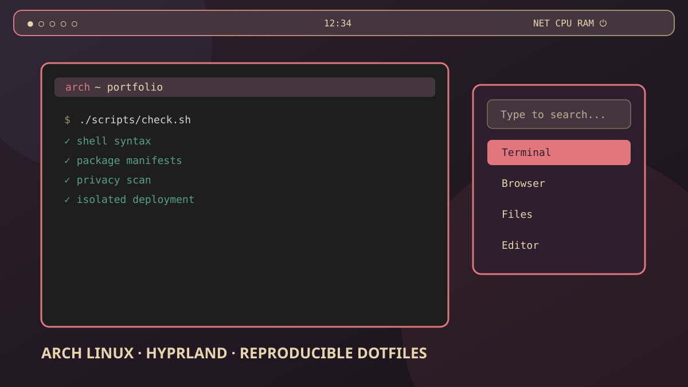

# Arch Linux workstation portfolio



A reproducible, security-reviewed version of my real Arch Linux workstation: Wayland desktop, launchers, editor, audio/Bluetooth tuning, security services, storage design and maintenance automation.

> This is not a raw home-directory dump. It preserves the architecture and behavior while removing credentials, device IDs, UUIDs, hostnames, private paths, personal application inventories and private media.

## What is reproduced

| Layer | Components | Engineering focus |
|---|---|---|
| Desktop | Hyprland, Waybar, Kitty, Dunst | Keyboard-first tiling and one coherent warm-night palette |
| Launchers | Rofi, dmenu, Wofi | Three real entry points, consistently styled where supported |
| Editor | Neovim, NvChad, Avante, LSP, Treesitter | Locked plugins, Wayland clipboard and one integrated AI interface |
| Audio | PipeWire, PipeWire-Pulse, WirePlumber | 48/96 kHz graph, underrun headroom and selectable Bluetooth policy |
| Bluetooth | BlueZ, Blueman | Privacy, secure connections and resilient reconnection |
| Security | UFW, ClamAV, rkhunter, Lynis, KeePassXC | Default-deny inbound firewall, fresh signatures and scheduled audits |
| Storage | Btrfs system/home + native and shared data tiers | Fast system disk, separated bulk data, safe optional mounts |
| Deployment | Pacman manifests + GNU Stow | Reviewed dependencies, reversible conflicts and idempotent links |
| Publication | Custom privacy scanner + Gitleaks | Scan source candidates, tracked tree and Git history |

## Quick start

```bash
git clone https://github.com/gitsual/archlinux-portfolio.git
cd archlinux-portfolio
./scripts/bootstrap.sh --dry-run
./scripts/check.sh
```

Install official packages and deploy all user configuration:

```bash
./scripts/bootstrap.sh
```

Apply the reviewed system security/Bluetooth profile only after a dry run:

```bash
./scripts/apply-system.sh --dry-run
./scripts/bootstrap.sh --no-install --system
```

Deploy selected packages:

```bash
./scripts/deploy.sh hypr waybar nvim audio
```

Existing files are never deleted. Conflicts move to a timestamped backup under `${XDG_STATE_HOME:-$HOME/.local/state}/archlinux-portfolio/backups/`. Stow runs with `--no-folding`, so local hardware overlays cannot write through a linked directory into the repository.

## Repository map

```text
dotfiles/              User-level Stow packages
  hypr/                Compositor, lock screen and desktop actions
  waybar/ kitty/ dunst/
  rofi/ wofi/          Launchers and power menu
  nvim/                Full active editor configuration and lockfile
  audio/               Portable PipeWire/WirePlumber baseline
  theme/ shell/        GTK/KDE visual defaults and safe shell baseline
  security/            User malware timer and audit command
system/                Reviewed system-level templates
profiles/              Optional NVIDIA and hardware-specific audio profiles
packages/              Official/AUR manifests
docs/                  Architecture, audit and LinkedIn copy
scripts/               Bootstrap, deploy, update, render and audit tools
```

## Documentation

- [Storage architecture](docs/disk-architecture.md)
- [Audio and Bluetooth](docs/audio-bluetooth.md)
- [Security architecture](docs/security-architecture.md)
- [Neovim and Avante](docs/neovim.md)
- [Services and maintenance](docs/services.md)
- [Sanitization decisions](docs/design-notes.md)
- [Workstation coverage matrix](docs/coverage-matrix.md)
- [Publication audit](docs/audit-report.md)

## Hardware profiles

The portable Hyprland baseline does not force a GPU. To reproduce the NVIDIA branch used by the source workstation, replace the deployed `hardware.conf` symlink with a local copy of `profiles/hardware/nvidia-hyprland.conf`. Audio device node names are rendered locally by `scripts/configure-audio.py` and are never committed.

The wallpaper is also local-only: add it to `hyprpaper.conf` after deployment. The public SVG is a purpose-built preview, not a desktop capture containing private data.

## Verification

`scripts/check.sh` validates shell, Python, JSON, Lua, systemd units, package manifests, symlinks, file types and privacy patterns, runs Gitleaks, and performs both a dry run and a two-pass deployment regression in temporary HOMEs. `scripts/test-neovim.sh` performs the separate clean editor installation and startup assertions without calling external AI services. Publication also requires scanning the exact staged Git objects and resulting commit before push.

## License

MIT
